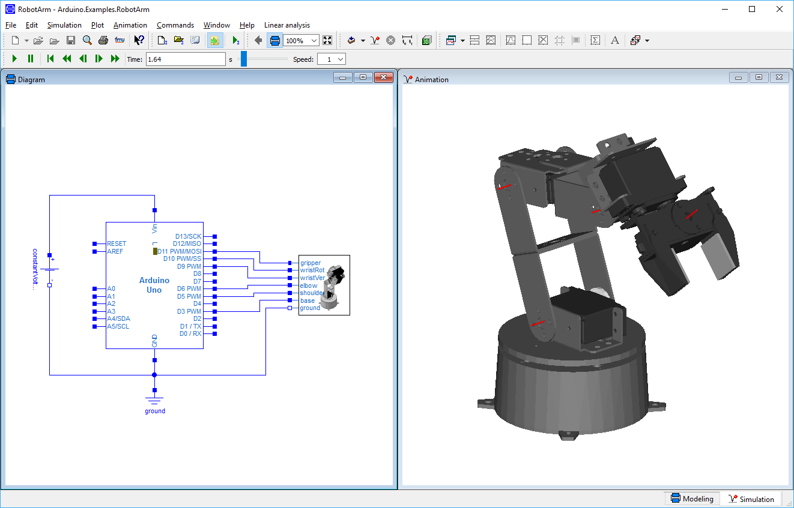
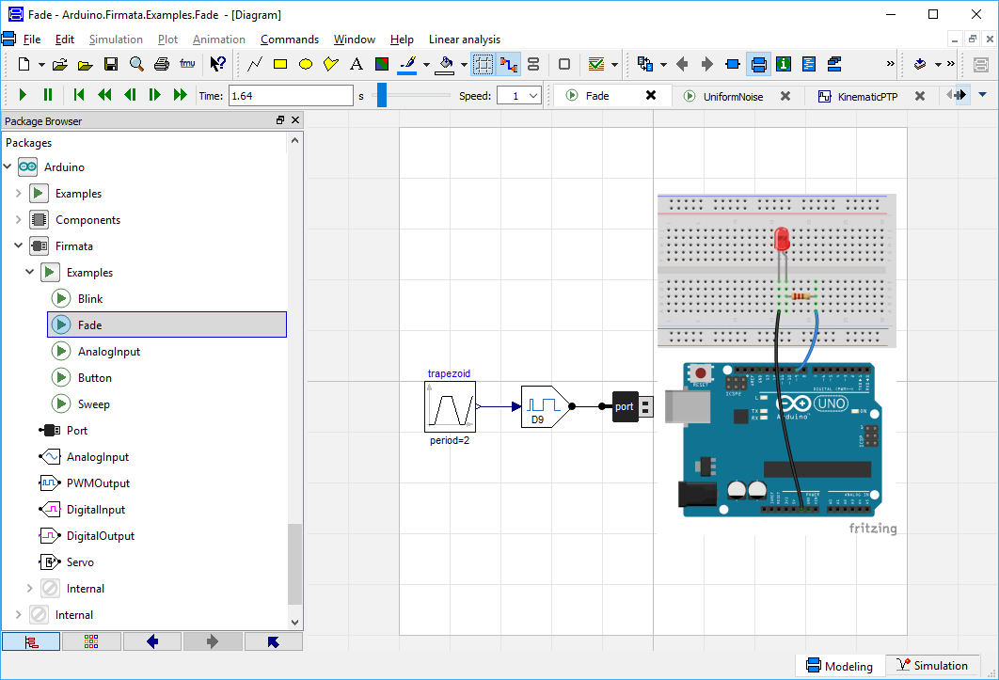

With the Arduino Modelica library you can simulate your circuits and [sketches](https://www.arduino.cc/en/Tutorial/Sketch) on a virtual [Arduino Uno](https://www.arduino.cc/en/Main/ArduinoBoardUno) and connect your Modelica models to real-world circuits using the [Firmata protocol](http://www.firmata.org/).

It's developed by Dassault Systèmes and released under the GPLv3 on [GitHub](https://github.com/CATIA-Systems/Modelica-Arduino).

#### How does it work?

The ArduinoUno model is driven by an ExternalObject that contains the compiled sketch and an implementation of the Arduino API. The external object is synchronized at every sample step with the Modelica model.

When a model that contains the ArduinoUno block is translated the external object is automatically re-built through the preInstantiate=Arduino.Internal.buildSketch(...) directive in its annotation.

This function writes a new Sketch.cpp to Arduino/Resources/Source/Arduino that includes the sketch currently selected in the ArduinoUno component and calls the build script build_sketch.bat.

This script re-builds the shared libraries Arduino/Resources/Library/win32/ModelicaArduino.dll and win64/ModelicaArduino.dll that contain the implementation of the external object.
